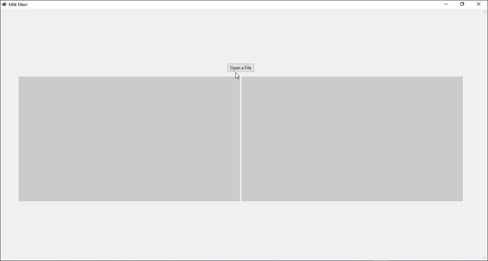

# Milk-Filter
Choose any image you like and convert it to something you would find in the series Milk inside/outside a bag of milk! There is also another effect which you can try for different results.


## Showcase



## How to open the program?
### On PC
There is an EXE file attached which should work perfectly fine on Windows. To download it, head to the releases section of this GitHub page (should be to the right of the website on PC).

If you are on an OS that doesn't support EXE files, you can download the source code (the file called filter.py), then install Python if you haven't already, install Pillow (the library the program uses to edit the images):
```
pip install pillow
```
and finally on the command line, insert:
```
python filter.py
```
If you downloaded the whole repository, `pip install -r requirements.txt` installs everything it needs. On Linux you may also need Tkinter for the window, for example `sudo apt install python3-tk` on Ubuntu/Debian.
### On Android
Keep in mind this program was not made for Android, and these steps are just to be baaaarely usable in it, and should be used this way only if you have no other choice. Expect it to be messy and overall bad. Nonetheless, it should still get the job done, I got it to work at least. So here are the steps:

1. Download Pydroid3 on Play Store
2. Download the file filter.py from this repository
3. Open the file on Pydroid3
   
4. Click the top left hamburguer and click on terminal
5. There, write:
   ```
   pip install pillow
   ```
6. Go back, and click on the play button in the bottom right corner
7. It should "work" now. You can open the image, apply the effect, and save the image.

Important notes: 
- Big images can still take a few seconds for the filter to be applied on a phone, just wait while the bar is moving. Remember this was made for PC and not for mobile.
- The "app" is best viewed in portrait mode: then it uses shorter texts and puts the images under each other.
- Use this slider to move horizontally when opening an image:
  

### On the command line
The same filter.py works from the command line too (install Pillow as explained above, Tkinter isn't needed here). Write on your command line of preference:
   ```
   python3 filter.py [-flags]
   ```
Without flags it opens the GUI. These are the flags:
```
-h, --help       Shows the help message and how to use it.
-f, --file FILE  Specify input image.
-o, --out OUT    Specify out path.
-a, --alt        Alternative Milk effect (the effect from the second game).
-p, --pointism   Pointillism effect.
-c, --comp COMP  Compression. from 0 to 100. Defaults to 0.
```

So, imagine you want to apply the effect from the second game to image.png, give it the pointillism effect, compress it and save it as saved.png. You would write:

   ```
   python3 filter.py -f image.png -a -p -c 30 -o saved.png
   ```

## How do I use the GUI version?

1. Click on "Open a File"
2. Choose the image you want to convert. It supports png, jpg and jpeg files.
3. Choose if you want to compress the image or not. Compression gives a more pixelated look that can sometimes imitate the look of the games. Nonetheless, I recommend against using it in most cases.
4. Choose if you want to give the "pointillism" effect. Don't know how will it look? Give it a try!
5. Choose between applying the effect from the first or the second game.
7. Click on "Apply filter". A moving bar shows while the image is being converted, bigger images take a bit longer.
8. A new window will open showcasing the new image, and a button that will open the new image in your default image viewer.
9. In the main window, you can choose to save the image by clicking on the "Save image" button.
10. You can repeat this process until you are satisfied.

## Notes

- The program will take longer as the image size is bigger.
- Please contact me in lucamuino@gmail.com if you find any bugs, issues, or you want a new feature!
- Expect the program to be kind of simple. I put up a GUI quickly to remove the need to do it in console.
- You are free to do whatever you want with this code. If you want to help adding features, making it prettier, or just refactoring the code, I'll be happy to review them.

## Extra note
Big thanks to [@R00tKited](https://github.com/R00tKited) for the improvements and refactoring to the code!
Also to [@Krak9n](https://github.com/Krak9n) for the X11 fix, and to [@horoni](https://github.com/horoni) for the cli version of the script.

## Final comments

I hope you enjoy this simple program! I would be very happy to see what things you'll make with this :). 

If you want to support me for some reason, you can donate through here: https://ko-fi.com/lucasins
